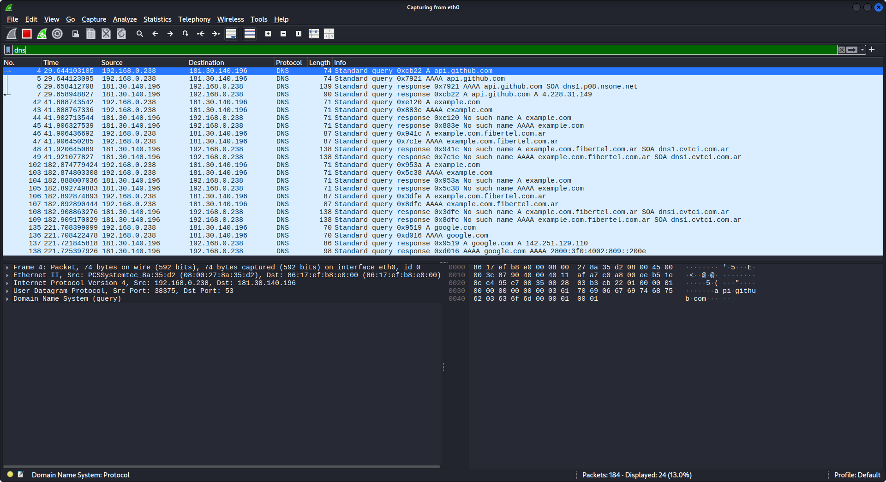

#  Traffic Analysis Lab (Wireshark)

Objective
Analyze network traffic to identify normal behavior and understand how systems communicate over a network.

Tools Used
- Wireshark
- Kali Linux

Traffic Analysis

DNS Requests
Observed domains:
- google.com
- api.github.com
- fibertel.com.ar

Additionally, AAAA (IPv6) queries for google.com were detected.

HTTPS Traffic
Detected secure connections to external IP:

- 4.228.31.149:443

This indicates encrypted communication using HTTPS.

Uncommon Traffic
No unusual ports were observed. Traffic was limited to standard web ports (80 and 443).

Findings

- Normal browsing generates DNS queries and HTTPS traffic
- Multiple domains are resolved before establishing connections
- HTTPS encrypts communication between the client and external servers
- No suspicious or abnormal traffic was detected

Conclusion

This lab demonstrates how to capture and analyze real network traffic using Wireshark, identifying normal communication patterns and understanding DNS and HTTPS behavior.

## Author
Tomas Brown
=======
# 🔐 Network Analysis Lab (Nmap + Wireshark)

## 📌 Objective
Perform a basic network analysis to identify open ports, active services, and analyze real network traffic.

---

## 🛠 Tools Used
- Nmap
- Wireshark
- Kali Linux

---

## 🔍 Nmap Scan

Command used:
nmap -F 192.168.0.1

### Results:
- 53/tcp → open → DNS
- 80/tcp → open → HTTP
- 443/tcp → open → HTTPS
- 22/tcp → filtered → SSH
- 23/tcp → filtered → Telnet

📸 Evidence:

---

## 🌐 Wireshark Analysis

### DNS Traffic
Captured DNS query for:
api.github.com

Response:
api.github.com → 34.160.144.191

### HTTPS Traffic
Observed TCP communication with:
34.160.144.191:443

Including:
- SYN
- ACK
- FIN / RST

📸 Evidence:

---

## 🧠 Key Findings
- Identified exposed services on local network
- Observed DNS resolution process
- Analyzed encrypted HTTPS traffic
- Understood real network communication flow

---

## 🚀 Future Improvements
- Deep packet inspection
- Suspicious traffic detection
- Advanced Nmap scanning techniques

---

## 👤 Author
Brown Tomas
>>>>>>> 4dfbb3fe9f0acdd84dbd9580ebdab6eed557eaa7
